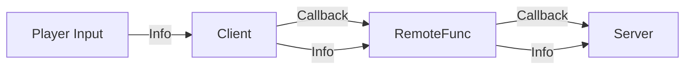

# Home
I've made this doc to explain on how to make Dragon Ball Warriors forms, since Dragon Ball Warriors do use DB Rage system as a base, it isn't really hard to modify it.

---
### **Pre-requisites**
* Basic knowledge of ROBLOX STUDIO.
* Basic/Intermediate knowledge of LuaU. (Roblox Studio scripting language)
* Assets ready for your forms. (Hairs, auras, etc...)
* Time.

---
### **Getting Started**

##### **Finding the Modules**
* Find the Forms Module. `game.ReplicatedStorage.ModosModulos`
* Find the Forms Multiplier Module. `game.ServerStorage.ModeBoostModule`
* Find the Skills Module. `game.ReplicatedStorage.Skills.Skillzz`

##### **Finding the Asset Folder**
The asset folder is really important, that is what stores the hair, aura and overall effects.

* The asset folder should be `game.ServerStorage.Skills.Assets`

***DISCLAIMER: You need to place your assets inside this folder***

##### **Finding the essential scripts**
* Find the transformation script. `game.ServerScriptService.Cosas.Tecnicas`

---
### Setting up the new transformations.
##### **Setting up Forms Module**

First of all you need to open the `ModosModulos`, after opening it you will see a lot of indexes with: `modes["Form"] = "Form"`, you will basically do the same. (**ALWAYS PUT IT BEFORE THE RETURN MODES LINE**)

It should be like this:
```lua title="ModosModulos"
local modes = {} -- Line 1
-- Stuff stuff
modes["Super Saiyan Potato"] = "Super Saiyan Potato" -- Line X
return modes -- Line Y (always on the end)
```

##### **Setting up Multiplier Module**

After setting up the form, you will now set up the multiplier of that form, open `ModeBoostModule`, after opening it, you may see things similar to the `ModosModulos`, you will follow the same thing.

* ``modes["Put the ModosModulos value that you made"] = Multiplier``

It should be something like this:

```lua title="ModeBoostModule"
    local modes = {} --line1
    -- line line line line
    modes["Super Saiyan Potato"] = 10000
    return modes -- Always on the last line
```

##### **Setting up the Forms requirements**
After doing everything above you will need to open the **Skillz** Script, it may be confusing at the start but it's easy to learn, first of all you will:

* Try to find the Modes table.
```lua title="Skillz"
local module = {
    ---Ignore
    Modes = {

    };
    --Ignore
}
```

After finding it, you will need to write on a line inside the Modes table following the same example of the others.

```lua title="Skillz"
local module = {
    ---Ignore
    Modes = {
        --Ignore everything inside
        {"ModosModulo Form Name", Attack, Ki, Defense}; -- IIRC it's in that order, you will put down numbers that are the forms requirement.
    };
    --Ignore
}
```

If it was made correctly, it should be like this:

```lua title="Skillz"
local module = {
    --Ignore
    Modes = {
        --Ignore everything else inside
        {"Super Saiyan Potato", 3500000, 3500000, 3500000};
    }
    --Ignore
}
```

---
##### **Setting up the transformation script**
Now is where the son cries and the mother doesn't sees, this will be something that may take some good time to understand and learn.

Open the Script ``Tecnicas``, after opening it i'd recommend you to press ++ctrl+shift+e++, after doing it the functions should collapse and it will be easier to navigate.

Now you will create a function like others, first of all you will insert:

```lua title="Tecnicas"
modes["MODOSMODULO FORM NAME HERE"] = function(player, toggle, data, modeNumber, animation, flying)

end
```

Do you see the parameters, right? They are: ``player, toggle, data, modeNumber, animation, flying``, i'll explain what theses are:

* **Player**, player is the player instance.
* **toggle**, toggle is when player pressed the button to transform, if the player wants to transform, it will be **True**, if the player wants to untransform, it will be **False**
* **Data**, Data is basically the character table sent from the client (idk why they named it as Data)
* **ModeNumber**, Useless thing, you wont use, just ignore it.
* **Animation**, the usual transforming animation, nothing else.
* **Flying**, it will tells the script if the player is flying or not.

Theses parameters are sent by a remote function called from the client, sending thoses informations.




Now, you will insert inside that function an If/Else Statement to check if the player wants to transform or the opposite.

```lua title="Tecnicas"
modes["MODOSMODULO FORM NAME HERE"] = function(player, toggle, data, modeNumber, animation, flying)
    if toggle then
        -- Here we will place the entire transformation script (True)
    else
        -- Here we will place the entire untransformation script (False)
end
```

After doing that we will insert another if/else statement inside the True part inside the if toggle.

```lua title="Tecnicas"
modes["MODOSMODULO FORM NAME HERE"] = function(player, toggle, data, modeNumber, animation, flying)
    if toggle then
        if flying == false then
            -- The code inside this will run if the player isn't flying while transforming, useful if you want to place some ground effects.
        end

    else
end

```

Well, we now will continue scripting.

```lua title="Tecnicas"
modes["MODOSMODULO FORM NAME HERE"] = function(player, toggle, data, modeNumber, animation, flying)
    if toggle then
        animationBind(animation) -- This line of code will make the player start doing the charge animation to transform. (Optional)
        if flying == false then
            task.spawn(function()
                Rocks(20, data)
                -- IF THE PLAYER ISN'T FLYING, THEN THE SCRIPT WILL SPAWN A FUNCTION (That won't yield the entire script) WHICH SPAWN ROCKS! (Optional)
            )
        end
    else
end
```

As you can see, we added some new things, basically task.spawn spawns a function that doesn't yields the entire script, i'd recommend you taking a look at here: 
